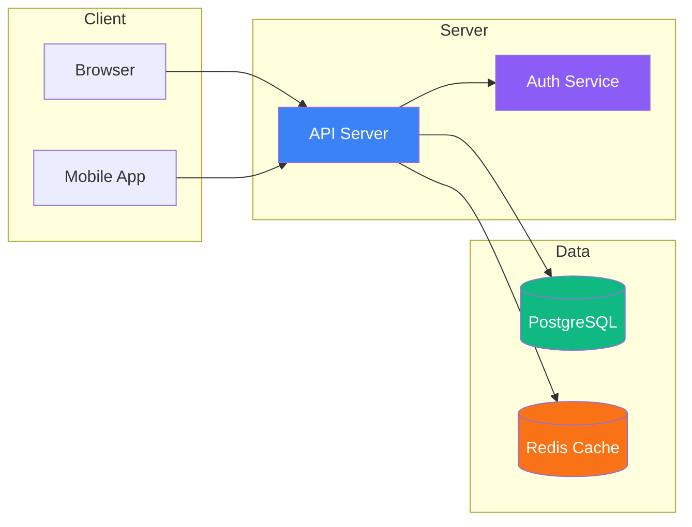

```typescript
type ApiResponse<T> = {
  data: T
  error?: string
}

export async function fetchJSON<T>(url: string): Promise<ApiResponse<T>> {
  try {
    const res = await fetch(url)

    if (!res.ok) {
      throw new Error(`HTTP ${res.status}`)
    }

    const data = await res.json()
    return { data }
  } catch (error) {
    return { data: null as T, error: (error as Error).message }
  }
}
```

​
